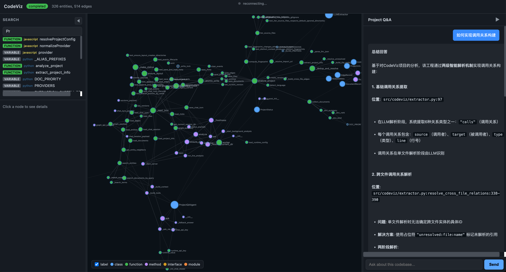

# OpenCodeViz

AI-powered local code graph visualization and codebase Q&A for real repositories.

`codeviz-ai` is the npm package name used for publishing.
`codeviz` remains the CLI command.

[)](https://www.npmjs.com/package/codeviz-ai)
[](https://bundlephobia.com/package/codeviz-ai)
[](https://www.npmjs.com/package/codeviz-ai)
[](https://www.npmjs.com/package/codeviz-ai)



Language:
[English](#english) | [中文](#中文)

---

## English

<details open>
<summary><strong>Open English</strong></summary>

### Overview

OpenCodeViz scans source code and Markdown documents, stores versioned analysis snapshots in `.codeviz/`, parses supported languages with an AST-first pipeline, resolves cross-file relations deterministically, and uses LLMs only where they still add value: legacy `llm` extraction mode, unresolved fallback in `hybrid` mode, and project Q&A.

### Features

- Multi-language repository scanning
- AST-first extraction currently implemented for Python (`.py`, `.pyi`), JavaScript (`.js`, `.mjs`, `.cjs`), JSX (`.jsx`), TypeScript (`.ts`), and TSX (`.tsx`)
- Interactive code visualization (graph view) for exploring entities and relationships
- Architecture diagrams (module/package dependency layouts and visual summaries)
- Flow diagrams (call and data flow visualizations across files and services)
- Versioned analysis snapshots
- Project Q&A based on the latest snapshot

### Analysis Architecture

The current analysis pipeline is:

1. discover files, fingerprints, and Markdown documents
2. parse supported source files with `tree-sitter` based AST extractors
3. resolve same-file and cross-file entities and relations deterministically
4. optionally invoke unresolved fallback when `extractorMode=hybrid` and `fallbackMode` allows it
5. derive architecture and flow assets from the saved graph snapshot
6. serve the local UI and snapshot-backed Q&A APIs

Extraction mode behavior:

- `hybrid` is the default and uses AST-first extraction with unresolved-only LLM fallback
- `ast` keeps the whole extraction pipeline deterministic and skips LLM extraction
- `llm` keeps the legacy per-file LLM extractor for languages or repos where you want that behavior

Current AST parser coverage:

- Python: `.py`, `.pyi`
- JavaScript: `.js`, `.mjs`, `.cjs`
- JSX: `.jsx`
- TypeScript: `.ts`
- TSX: `.tsx`

In `hybrid` mode, files outside this AST coverage fall back to the legacy per-file LLM extractor.


### Supported Source Types

These entries describe source file types the scanner recognizes. They do not imply AST parser coverage beyond the languages listed in `Current AST parser coverage`.

- JavaScript / TypeScript: `.js` `.jsx` `.mjs` `.cjs` `.ts` `.tsx`
- Python: `.py` `.pyi`
- JVM languages: `.java` `.kt` `.kts` `.scala`
- Systems languages: `.go` `.rs` `.c` `.cpp` `.cc` `.cxx` `.h` `.hpp`
- Others: `.rb` `.php` `.swift` `.cs` `.sh` `.bash` `.lua` `.dart`

Default ignored directories:

- `.codeviz`
- `.git`
- `.venv` `venv`
- `node_modules`
- `dist` `build` `vendor`
- `fixtures`
- `.next` `.nuxt`
- `target` `out`
- `coverage`

The scanner also respects project `.gitignore` rules.

### Requirements

- Python 3.12+
- Node.js 18+
- An LLM API key if you use `hybrid` or `llm` extraction, unresolved fallback, or project Q&A

Python runtime dependencies are defined in [pyproject.toml](/Users/hmj/Desktop/project/show-your-code/pyproject.toml).

### Package Name and CLI Name

- npm package: `codeviz-ai`
- CLI command: `codeviz`

This means installation uses `codeviz-ai`, but all runtime commands still use `codeviz`.

### Installation

#### Option 1: npm CLI install

Install from the published package:

```bash
npm install -g codeviz-ai
```

Or install from the local repository:

```bash
npm install
npm install -g .
```

Then initialize the managed Python runtime:

```bash
codeviz setup
```

`codeviz setup` will:

- Check for Python 3.12+
- Create a managed virtual environment under the global config directory
- Install the Python package in editable mode
- Write the global CLI config

Default global config directory:

- macOS / Linux: `~/.config/codeviz/`
- Windows: `%APPDATA%/codeviz/`

Override with:

- `CODEVIZ_CONFIG_HOME`

#### Option 2: Local Python install from this repository

Use this mode if you have already cloned this repository and want to run or develop OpenCodeViz locally.

```bash
git clone git@github.com:huamingjie0815/OpenCodeViz.git
cd OpenCodeViz
python3 -m venv .venv
source .venv/bin/activate
pip install -e .
```

If you do not want to clone first, you can also install directly from GitHub:

```bash
pip install "git+https://github.com/huamingjie0815/OpenCodeViz.git"
```

To enable the `deepagents`-powered Q&A runtime:

```bash
pip install -e '.[runtime]'
```

Then run:

```bash
python -m codeviz analyze /path/to/project --no-browser
python -m codeviz open /path/to/project --no-browser
python -m codeviz ask /path/to/project "What does this service layer do?"
```

### Deployment and Publish

To prepare the npm package for publishing:

```bash
npm install
npm run build:web
```

To publish:

```bash
npm publish
```

If you publish under an npm scope, keep the CLI `bin.codeviz` mapping unchanged.

### Configuration

Runtime config is resolved in this order:

1. Environment variables
2. Project config: `<project>/.codeviz/config.json`
3. Global config written by `codeviz setup`

Common config fields:

- `provider`
- `model`
- `apiKey`
- `apiKeyEnv`
- `baseUrl`
- `port`
- `extractorMode`
- `fallbackMode`

Supported environment variables:

- `CODEVIZ_CONFIG_PATH`
- `CODEVIZ_PROVIDER`
- `CODEVIZ_MODEL`
- `CODEVIZ_API_KEY`
- `CODEVIZ_API_KEY_ENV`
- `CODEVIZ_BASE_URL`
- `CODEVIZ_EXTRACTOR_MODE`
- `CODEVIZ_FALLBACK_MODE`

Current default model mapping:

- `openai` -> `gpt-4o-mini`
- `anthropic` -> `claude-sonnet-4-20250514`
- `google_genai` -> `gemini-2.0-flash`

Example project config:

```json
{
  "provider": "openai",
  "model": "gpt-4o-mini",
  "apiKeyEnv": "OPENAI_API_KEY",
  "baseUrl": "https://api.openai.com/v1",
  "port": 39127,
  "extractorMode": "hybrid",
  "fallbackMode": "auto"
}
```

Extraction modes:

- `llm`: keep the legacy per-file LLM extractor
- `ast`: use AST-only extraction and skip per-file LLM extraction
- `hybrid`: use AST-first extraction with unresolved-only LLM fallback

Fallback modes:

- `off`: never invoke unresolved fallback
- `auto`: invoke fallback only for unresolved relations with viable candidates
- `always`: attempt fallback for every eligible unresolved relation

### Setup Modes

There are two setup entry points:

- `codeviz setup`
  - npm CLI setup
  - writes global config
  - prepares the managed Python environment
- `python -m codeviz setup [project]`
  - Python CLI setup
  - writes `<project>/.codeviz/config.json`
  - configures provider, model, API key, base URL, and port for one project

For normal CLI usage, prefer `codeviz setup`.

### Commands

#### `analyze`

```bash
codeviz analyze /path/to/project
codeviz analyze /path/to/project --no-browser
codeviz analyze /path/to/project --port 39127
```

Starts the local server and runs analysis in the background.

#### `reanalyze`

```bash
codeviz reanalyze /path/to/project --no-browser
```

Currently behaves the same as `analyze`.

#### `open`

```bash
codeviz open /path/to/project
```

Opens the local UI for an existing snapshot.

#### `ask`

```bash
codeviz ask /path/to/project "How is the login flow implemented?"
```

If the project has not been analyzed yet, `ask` triggers analysis first.

### Data Directory

Each analyzed project gets:

```text
.codeviz/
  config.json
  current.json
  versions/
    <run_id>/
      meta.json
      files.json
      entities.json
      edges.json
      documents.json
      architecture.json
      flow_index.json
      events.json
      project_info.json
  chat/
```

Meaning:

- `versions/<run_id>/` is one full analysis snapshot
- `current.json` points to the active snapshot
- `meta.json` stores status and counters
- `architecture.json` stores derived module and dependency assets
- `flow_index.json` stores derived flow entry candidates
- `events.json` stores analysis events
- `chat/` stores Q&A sessions

### Web UI and API

The local HTTP server binds to `127.0.0.1`.
The default port selection starts at `39127` and avoids common dev ports such as `3000`, `5173`, `8000`, and `8080`.

Main endpoints:

- `/api/status`
- `/api/graph`
- `/api/architecture`
- `/api/flow/index`
- `/api/flow`
- `/api/project-info`
- `/api/versions`
- `/api/events`
- `/api/stream`
- `/api/chat`
- `/api/chat/session`
- `/api/chat/turn/<turn_id>`

### Repository Layout

```text
src/codeviz/
  __main__.py
  app.py
  architecture.py
  commands.py
  project.py
  analysis.py
  extractor.py
  runtime_config.py
  parsing/
  resolution/
  qa_agent.py
  server.py
  storage.py
  web/

lib/
  cli.js
  setup.js
  python.js

tests/
```

### Development

```bash
npm install
python3 -m venv .venv
source .venv/bin/activate
pip install -e '.[runtime]'
pytest
```

Basic CLI check:

```bash
python -m codeviz --help
```

### Known Limitations

- AST parsing is currently implemented for Python (`.py`, `.pyi`), JavaScript (`.js`, `.mjs`, `.cjs`), JSX (`.jsx`), TypeScript (`.ts`), and TSX (`.tsx`)
- Hybrid and `llm` modes still depend on model availability for fallback extraction and Q&A
- Source files larger than `50KB` are skipped
- `reanalyze` does not yet have independent semantics
- The web UI is bundled static content, not a separate frontend app

</details>

---

## 中文

<details>
<summary><strong>展开中文</strong></summary>

### 项目介绍

OpenCodeViz 是一个面向真实本地仓库的代码关系图和项目问答工具。

它会扫描源码与 Markdown 文档，把分析结果按版本写入 `.codeviz/`，并优先通过 AST-first 管线抽取代码实体和关系、用确定性规则做跨文件解析，只在仍然有价值的地方使用 LLM：旧版 `llm` 抽取模式、`hybrid` 模式下的未解析回退，以及项目问答。

### 功能

- 多语言仓库扫描
- 当前 AST-first 抽取已实现对 Python（`.py`, `.pyi`）、JavaScript（`.js`, `.mjs`, `.cjs`）、JSX（`.jsx`）、TypeScript（`.ts`）和 TSX（`.tsx`）的支持
- 代码可视化（交互式图谱视图），便于探索实体与依赖关系
- 架构图（模块/包依赖布局与可视化摘要）
- 流程图（跨文件与服务的调用/数据流可视化）
- 版本化分析快照
- 基于快照的项目问答

### 分析架构

当前分析流程是：

1. 发现源码文件、内容指纹和 Markdown 文档
2. 对支持的语言使用基于 `tree-sitter` 的 AST 解析器
3. 用确定性规则完成同文件和跨文件实体、关系解析
4. 当 `extractorMode=hybrid` 且 `fallbackMode` 允许时，只对未解析关系调用 LLM 回退
5. 基于保存后的图快照派生架构图和流程图资产
6. 提供本地 Web 界面和基于快照的问答 API

抽取模式说明：

- `hybrid` 是默认模式，优先走 AST 抽取，仅对未解析关系使用 LLM 回退
- `ast` 保持整条抽取链路为确定性流程，不调用 LLM 抽取
- `llm` 保留旧版逐文件 LLM 抽取，适合你明确想使用旧行为的场景

当前 AST 解析层覆盖范围：

- Python：`.py`, `.pyi`
- JavaScript：`.js`, `.mjs`, `.cjs`
- JSX：`.jsx`
- TypeScript：`.ts`
- TSX：`.tsx`

在 `hybrid` 模式下，超出上述 AST 覆盖范围的文件会退回旧版逐文件 LLM 抽取路径。


### 支持的源码类型

这里列的是扫描器可识别的源码类型，不等同于 AST 解析层已经覆盖全部这些语言。AST 覆盖范围以上一节“当前 AST 解析层覆盖范围”为准。

- JavaScript / TypeScript: `.js` `.jsx` `.mjs` `.cjs` `.ts` `.tsx`
- Python: `.py` `.pyi`
- JVM 语言: `.java` `.kt` `.kts` `.scala`
- 系统语言: `.go` `.rs` `.c` `.cpp` `.cc` `.cxx` `.h` `.hpp`
- 其他: `.rb` `.php` `.swift` `.cs` `.sh` `.bash` `.lua` `.dart`

默认会跳过这些目录：

- `.codeviz`
- `.git`
- `.venv` `venv`
- `node_modules`
- `dist` `build` `vendor`
- `fixtures`
- `.next` `.nuxt`
- `target` `out`
- `coverage`

同时会额外读取项目 `.gitignore` 规则。

### 依赖要求

- Python 3.12+
- Node.js 18+
- 如果你要使用 `hybrid` / `llm` 抽取、未解析回退或项目问答，则需要可用的 LLM API Key

Python 运行时依赖定义在 [pyproject.toml](/Users/hmj/Desktop/project/show-your-code/pyproject.toml)。

### 包名与命令名

- npm 包名：`codeviz-ai`
- CLI 命令：`codeviz`

也就是说，安装时使用 `codeviz-ai`，运行时命令仍然是 `codeviz`。

### 安装部署

#### 方式一：作为 npm CLI 安装

安装发布后的 npm 包：

```bash
npm install -g codeviz-ai
```

如果是本地仓库安装：

```bash
npm install
npm install -g .
```

然后执行初始化：

```bash
codeviz setup
```

`codeviz setup` 会：

- 检查系统是否有 Python 3.12+
- 在全局配置目录创建受管虚拟环境
- 以 editable 模式安装 Python 包
- 写入全局 CLI 配置

默认全局配置目录：

- macOS / Linux: `~/.config/codeviz/`
- Windows: `%APPDATA%/codeviz/`

可通过 `CODEVIZ_CONFIG_HOME` 覆盖。

#### 方式二：从当前仓库本地安装 Python 包

这种方式适合你已经 `git clone` 了本仓库，并且希望在本地运行或参与开发。

```bash
git clone git@github.com:huamingjie0815/OpenCodeViz.git
cd OpenCodeViz
python3 -m venv .venv
source .venv/bin/activate
pip install -e .
```

如果你不想先 clone，也可以直接从 GitHub 安装：

```bash
pip install "git+https://github.com/huamingjie0815/OpenCodeViz.git"
```

如果要启用基于 `deepagents` 的问答运行时：

```bash
pip install -e '.[runtime]'
```

然后可以直接运行：

```bash
python -m codeviz analyze /path/to/project --no-browser
python -m codeviz open /path/to/project --no-browser
python -m codeviz ask /path/to/project "这个服务层负责什么？"
```

#### npm 发布

发布前建议执行：

```bash
npm install
npm run build:web
```

发布命令：

```bash
npm publish
```

如果后续改成带 scope 的 npm 包，也不要改 `bin.codeviz`，这样命令名可以继续保持稳定。

### 配置

运行时配置读取优先级：

1. 环境变量
2. 项目配置 `<project>/.codeviz/config.json`
3. `codeviz setup` 写入的全局配置

常用配置项：

- `provider`
- `model`
- `apiKey`
- `apiKeyEnv`
- `baseUrl`
- `port`
- `extractorMode`
- `fallbackMode`

支持的环境变量：

- `CODEVIZ_CONFIG_PATH`
- `CODEVIZ_PROVIDER`
- `CODEVIZ_MODEL`
- `CODEVIZ_API_KEY`
- `CODEVIZ_API_KEY_ENV`
- `CODEVIZ_BASE_URL`
- `CODEVIZ_EXTRACTOR_MODE`
- `CODEVIZ_FALLBACK_MODE`

当前默认模型映射：

- `openai` -> `gpt-4o-mini`
- `anthropic` -> `claude-sonnet-4-20250514`
- `google_genai` -> `gemini-2.0-flash`

项目配置示例：

```json
{
  "provider": "openai",
  "model": "gpt-4o-mini",
  "apiKeyEnv": "OPENAI_API_KEY",
  "baseUrl": "https://api.openai.com/v1",
  "port": 39127,
  "extractorMode": "hybrid",
  "fallbackMode": "auto"
}
```

抽取模式：

- `llm`：沿用旧版逐文件 LLM 抽取
- `ast`：只使用 AST 抽取，不做逐文件 LLM 抽取
- `hybrid`：优先使用 AST 抽取，仅对未解析关系使用 LLM 回退

回退模式：

- `off`：不调用未解析关系回退
- `auto`：只对存在可行候选的未解析关系调用回退
- `always`：对所有符合条件的未解析关系都尝试回退

### 两套 setup 的区别

- `codeviz setup`
  - npm CLI 入口
  - 写入全局配置
  - 准备受管 Python 环境
- `python -m codeviz setup [project]`
  - Python CLI 入口
  - 写入 `<project>/.codeviz/config.json`
  - 只配置当前项目的 provider、model、API key、base URL、port

正常使用 CLI 时，优先使用 `codeviz setup`。

### 命令

#### `analyze`

```bash
codeviz analyze /path/to/project
codeviz analyze /path/to/project --no-browser
codeviz analyze /path/to/project --port 39127
```

启动本地服务，并在后台开始分析。

#### `reanalyze`

```bash
codeviz reanalyze /path/to/project --no-browser
```

当前行为与 `analyze` 一致。

#### `open`

```bash
codeviz open /path/to/project
```

打开已有分析快照对应的本地界面。

#### `ask`

```bash
codeviz ask /path/to/project "登录流程是怎么实现的？"
```

如果项目尚未分析，`ask` 会先自动触发分析。

### `.codeviz/` 目录结构

```text
.codeviz/
  config.json
  current.json
  versions/
    <run_id>/
      meta.json
      files.json
      entities.json
      edges.json
      documents.json
      architecture.json
      flow_index.json
      events.json
      project_info.json
  chat/
```

含义：

- `versions/<run_id>/` 是一次完整分析快照
- `current.json` 指向当前使用的版本
- `meta.json` 保存状态和统计信息
- `architecture.json` 保存派生后的模块与依赖资产
- `flow_index.json` 保存派生后的流程入口索引
- `events.json` 保存分析过程事件
- `chat/` 保存问答记录

### Web 界面与 API

本地 HTTP 服务绑定在 `127.0.0.1`。
默认端口从 `39127` 起选，并主动避开 `3000`、`5173`、`8000`、`8080` 等常见开发端口。

主要接口：

- `/api/status`
- `/api/graph`
- `/api/architecture`
- `/api/flow/index`
- `/api/flow`
- `/api/project-info`
- `/api/versions`
- `/api/events`
- `/api/stream`
- `/api/chat`
- `/api/chat/session`
- `/api/chat/turn/<turn_id>`

### 仓库结构

```text
src/codeviz/
  __main__.py
  app.py
  architecture.py
  commands.py
  project.py
  analysis.py
  extractor.py
  runtime_config.py
  parsing/
  resolution/
  qa_agent.py
  server.py
  storage.py
  web/

lib/
  cli.js
  setup.js
  python.js

tests/
```

### 开发

```bash
npm install
python3 -m venv .venv
source .venv/bin/activate
pip install -e '.[runtime]'
pytest
```

基础命令检查：

```bash
python -m codeviz --help
```

### 已知限制

- AST 解析当前已实现对 Python（`.py`, `.pyi`）、JavaScript（`.js`, `.mjs`, `.cjs`）、JSX（`.jsx`）、TypeScript（`.ts`）和 TSX（`.tsx`）的支持
- `hybrid` 和 `llm` 模式下的回退抽取与问答仍然依赖模型可用性
- 大于 `50KB` 的源码文件会被跳过
- `reanalyze` 目前还没有独立语义
- 前端是内置静态资源，不是独立前端工程

</details>
